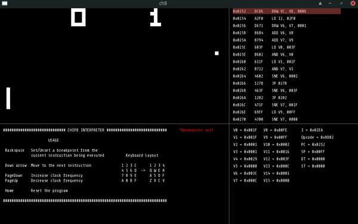

# chip8
Yet another chip8 emulator just for fun.

## Dependencies

* [SFML](https://www.sfml-dev.org/) Graphics library for the window drawing, keyboard input and sound.
* g++
* make

## Usage

Build 

`cd src/`
`make`

Run

`./chip8 <ROM-NAME>` i.e `./chip8 zero`

## Todo

* Unit tests
* timeless debugger
* code refactor
